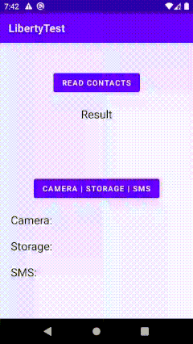

# Liberty
This library helps to manage runtime permissions handling. 
<br/>

<br/>

## Overview ##
   
Firstly, initialize the library in your activity or fragment:
```kotlin
Liberty.init(activity = this)
Liberty.init(fragment = this)
 ```
<br/>

To request permission, for instance, android.Manifest.permission.READ_CONTACTS
```kotlin
 Liberty.requestPermission(
                permission = android.Manifest.permission.READ_CONTACTS,
                requestCode = YOUR_REQUEST_CODE)
```

<br/>

In the next step, override onRequestPermissionsResult:
```kotlin
    override fun onRequestPermissionsResult(
        requestCode: Int,
        permissions: Array<out String>,
        grantResults: IntArray) {

        super.onRequestPermissionsResult(requestCode, permissions, grantResults)
        Liberty.onRequestPermissionsResult(receiver = this, requestCode, permissions, grantResults)
    }
```
Where the ```receiver = this``` is the object which will receive the result of the permission request.<br/> 
In this case, it is an instance of your activity or fragment,<br/>
but it could also be any other object. This will be described below.
 
<br/>

And in the final step, define functions that will handle results:
```kotlin
    @OnAllowed(YOUR_REQUEST_CODE)
    fun onContactsAllowed() {
        //Permission allowed
    }
    
    @OnDenied(YOUR_REQUEST_CODE)
    fun onContactsDenied() {
        //Permission denied
    }
    
    @OnNeverAskAgain(YOUR_REQUEST_CODE)
    fun onContactsNeverAskAgain() {
        //Clicked "Don't ask again"
    }
```
Functions names do not matter, but they should be without any arguments.
After permission request, the library will trigger a certain method, depends on the result.
For instance, if requested permission is allowed, the function annotated @OnAllowed will be called.

<br/>

## Warning ##
If you've initialized the library in an activity that extends from Activity(), 
you should manually call Liberty.clear() in the onDestroy(): 
```kotlin
class MainActivity : Activity() {

    override fun onDestroy() {
        super.onDestroy()
        Liberty.clear()
    }
}
```
In case, if your activity extends AppCompatActivity() or you've initialized 
Liberty in your fragment, you can don't care about clearing resources,<br/>
cuz the library handles this automatically.

<br/>

## Scoped permissions request ##
It often needs to request several permissions in a time.
<br/>

<br/>
To do this just call:
```kotlin
Liberty.requestPermissions(
                CAMERA,
                READ_EXTERNAL_STORAGE,
                READ_SMS,
                requestCode = YOUR_REQUEST_CODE)
```

And you need to define a function which will receive a result:
```kotlin
@OnPermissionsRequestResult(YOUR_REQUEST_CODE)
fun onPermissionsRequestResult(result: MutableList<Permission>) {
  //Handle permissions request result
}
```

The function name doesn't matter but should receive<br/>
only one argument with the type [```MutableList<Permission>```](#Additionally)

<br/>

## Custom receivers ## 
Let's assume you want to receive permissions request results in your ViewModel class.
To do this you just need to pass your ViewModel class instance as the receiver in onRequestPermissionsResult():
```kotlin
Liberty.onRequestPermissionsResult(receiver = yourViewModel, requestCode, permissions, grantResults)
```
And, accordingly, in the ViewModel class define functions which receive results:
```kotlin
    @OnAllowed(YOUR_REQUEST_CODE)
    fun onPermissionAllowed() {
        //Permission allowed
    }
```

<br/>

<a id="Additionally"></a>
## Additionally ##

```Permission``` class contains two fields:<br/>
```val name: String``` contains requested permission name<br/>
```val result: RequestResult``` contains permission request result state. Can be one of the: ```ALLOWED, DENIED, NEVER_ASK_AGAIN```
<br/>


